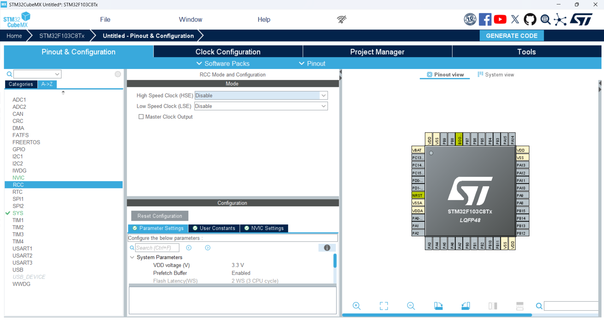
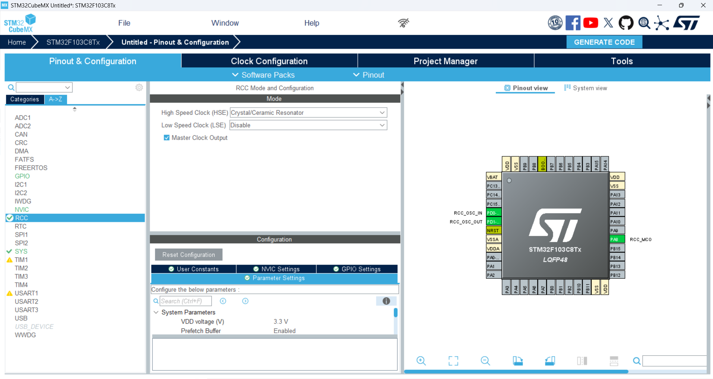
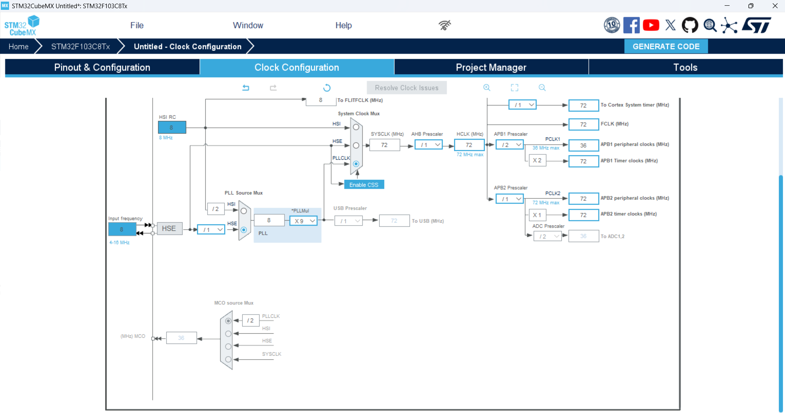
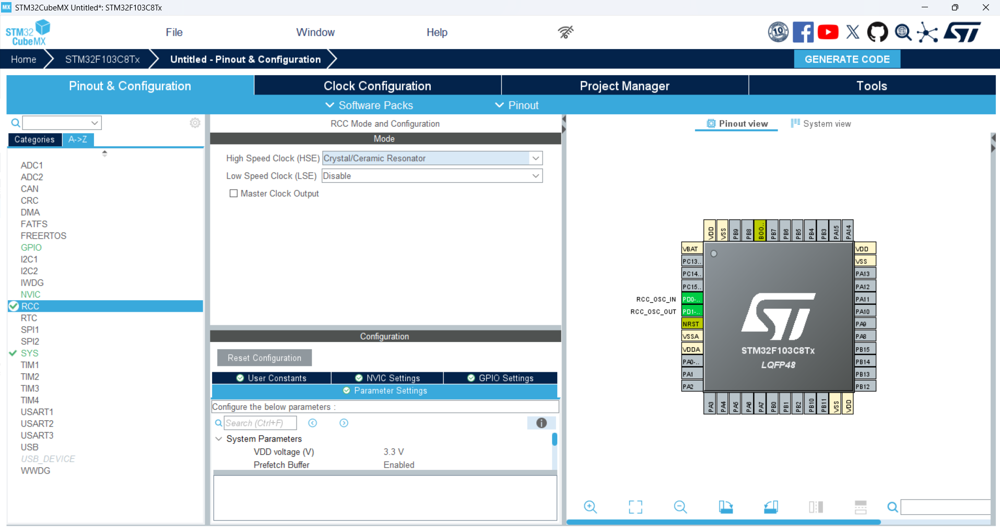
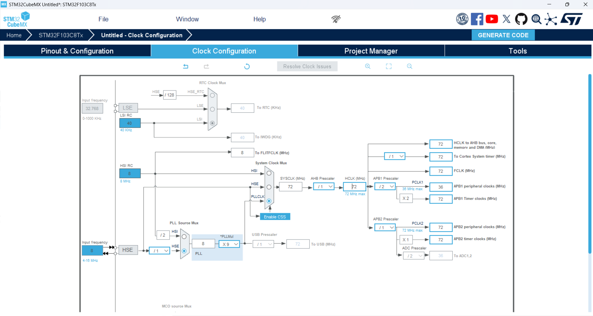

# ARM Architecture

## Introduction
**ARM (Advanced RISC Machine)** is a processor architecture based on **RISC (Reduced Instruction Set Computing)**, designed by **ARM Holdings**. ARM processors are known for their **low power consumption** and **high efficiency**, making them ideal for **mobile devices, embedded systems, and even supercomputers**.

---

## Key Features
1. **RISC Architecture**  
   - Simple instruction set with fewer instructions  
   - High execution speed  
   - Optimized power consumption  

2. **Energy Efficiency**  
   - Low power consumption, ideal for **battery-powered devices**  
   - Less heat generation compared to **x86 processors**  

3. **Thumb and Thumb-2 Instruction Sets**  
   - **Thumb:** 16-bit instructions to reduce memory usage  
   - **Thumb-2:** A mix of 16-bit and 32-bit instructions for optimized performance  

4. **ARM TrustZone**  
   - Security technology that separates **secure and non-secure execution environments**  

5. **Pipeline and Superscalar Execution**  
   - Uses **pipelining** for parallel instruction execution  
   - Some models support **Superscalar Execution** for enhanced performance  

6. **Different ARM Architectures (ARMv6, ARMv7, ARMv8, ARMv9)**  
   - **ARMv7:** Supports 32-bit architecture  
   - **ARMv8:** Supports 64-bit architecture  
   - **ARMv9:** Improved performance and security, designed for **AI and machine learning**  

---

## ARM Cortex Profiles
ARM Cortex processors are categorized into three main profiles:

- **Cortex-A**: Designed for **application processors** in mobile phones, tablets, and high-performance computing.
- **Cortex-R**: Designed for **real-time applications**, such as automotive and industrial control systems.
- **Cortex-M**: Designed for **low-power applications**, commonly used in microcontrollers and IoT devices.

### Cortex-M3 Architecture
- The number **3** in **Cortex-M3** indicates that it belongs to the **Performance Line**, which includes **three execution pipelines**.
- It is widely used in embedded systems requiring a balance of performance and power efficiency.
- For more technical details, refer to the **Technical Reference Manual for Cortex-M3**.

---

## Pipeline Execution
Pipelining is a technique that improves processor performance by executing multiple instructions in parallel. 

### Without Pipelining
Each instruction is executed sequentially, leading to longer execution time. For example, if processing a task requires three stages (input, processing, output) taking **1, 2, and 3 minutes**, respectively, then producing 3 units would take:

3 × (1 + 2 + 3) = 18 minutes

### With Pipelining
Each stage runs in parallel, significantly reducing total execution time. Instead of waiting for one instruction to finish before starting the next, different stages work simultaneously. With pipelining, the same task would take:

6 + 3 + 3 = 12  minutes

This technique significantly improves processor efficiency and is widely used in ARM processors.

---

## STM32CubeMX
**STM32CubeMX** is a graphical software tool developed by **STMicroelectronics** to simplify the configuration and initialization of **STM32 microcontrollers**.

### Key Features:
- **Graphical Pin Configuration:** Allows easy setup of GPIOs, peripherals, and clock settings.
- **Automatic Code Generation:** Generates initialization code for **STM32CubeIDE, Keil (MDK-ARM), or IAR**.
- **Middleware Support:** Includes libraries for **USB, FATFS, RTOS, and more**.
- **Power Consumption Calculator:** Estimates power consumption for different configurations.

STM32CubeMX is widely used in **embedded system development** to accelerate firmware development and reduce errors.

---

## MDK-ARM (Keil)
**MDK-ARM (Microcontroller Development Kit)** is an **IDE (Integrated Development Environment)** by **Keil (ARM)** for developing applications on ARM Cortex-based microcontrollers.

### Key Features:
- **μVision IDE:** Provides an easy-to-use environment for writing, compiling, and debugging code.
- **ARM Compiler:** Optimized for **Cortex-M, Cortex-R, and Cortex-A** processors.
- **Debugger & Simulation:** Supports **real-time debugging, instruction trace, and performance analysis**.
- **RTOS Support:** Includes **Keil RTX (Real-Time OS)** for multi-threaded applications.

MDK-ARM is widely used for **STM32, NXP, and other ARM-based microcontrollers** in industrial and consumer electronics projects.

---

## STM32 Microcontroller Programming
### STM32 Flash Loader
**STM32 Flash Loader** is a software tool developed by **STMicroelectronics** for programming STM32 microcontrollers that support **UART bootloader mode**.

### Key Features:
- Allows **firmware programming** via **UART (serial communication)**.
- No need for external programming tools; works directly with the microcontroller’s **BOOT mode**.
- Can be used for both **flashing firmware** and **reading/writing memory**.

### Boot Mode Configuration
To enter **bootloader mode**, the following connections should be made:
- **BOOT0 = VCC**
- **BOOT1 = GND**

This configuration enables the **internal bootloader**, allowing firmware upload via UART.

---

## J-Link Programmer & Debugger
**J-Link** is a **debugger and programmer** developed by **SEGGER** for ARM-based microcontrollers. It connects to microcontrollers via **JTAG** and communicates with the **PC via USB**.

### Features:
- Supports **JTAG and SWD (Serial Wire Debug) interfaces**.
- Compatible with various **IDEs**, including **Keil MDK-ARM**.
- Allows seamless debugging directly from Keil.
- Transfers **HEX or binary files** from the compiler to the microcontroller.

---

## STM32 ST-Link Utility
**STM32 ST-Link Utility** is an official **STMicroelectronics software** for programming STM32 microcontrollers.

### Features:
- Allows **direct programming** of STM32 microcontrollers.
- Similar functionality to **J-Link**, but optimized for **ST products**.
- Compatible with **ST-Link hardware tools**.

---

## ARM Microcontroller Families & Naming
- **Definition of Families:** Each microcontroller belongs to a specific **family** based on capabilities and applications.
- **Classification Based on Performance:** Families are categorized based on **processing power, peripherals, and power efficiency**.

### Benchmarking Tools:
- **Dhrystone:** Measures integer computing performance.
- **Whetstone:** Evaluates floating-point performance.
- **CoreMark:** Industry-standard benchmark for embedded processors.

---

## ARM vs. x86
| Feature | ARM | x86 |
|---|---|---|
| Architecture | RISC | CISC |
| Power Consumption | Low | High |
| Efficiency in Lightweight Processing | High | Moderate |
| Primary Applications | Mobile, IoT, Embedded Systems | PCs, Servers |

---

STM32 Microcontroller Naming Convention
The STM32 microcontrollers from STMicroelectronics follow a structured naming convention that provides useful information about the microcontroller's capabilities, core architecture, and intended application. This guide explains the naming system, series, core architectures, and other details.

STM32 Microcontroller Naming Structure
The STM32 microcontroller names typically follow this structure:

STM32<family/series><core><memory size><package type>
Example: STM32F407VG
STM32: Refers to the STM32 family of microcontrollers.
F: Denotes the STM32F series (the "F" signifies the mainstream series, which typically uses the ARM Cortex-M4 core).
407: Refers to the specific microcontroller model within the STM32F series (STM32F407). Higher numbers typically have more advanced features.
V: Indicates the flash memory size (192KB in this case).
G: Refers to the package type or the pin count (e.g., LQFP64 package type).
Main STM32 Series
STM32F Series
General-purpose microcontrollers based on ARM Cortex-M cores (e.g., Cortex-M0, Cortex-M3, Cortex-M4, Cortex-M7).
STM32L Series
Low-power microcontrollers with ARM Cortex-M cores (e.g., Cortex-M0+, Cortex-M3).
STM32H Series
High-performance microcontrollers with Cortex-M7 cores.
STM32G Series
Mid-range microcontrollers with Cortex-M4 or Cortex-M33 cores, balancing performance and power efficiency.
STM32W Series
Wireless microcontrollers with integrated radio (e.g., Bluetooth, ZigBee).
STM32U Series
Ultra-low-power microcontrollers for battery-powered and energy-efficient applications.
Core Architectures
M0/M0+: ARM Cortex-M0 and Cortex-M0+ cores designed for low-power and low-cost applications.
M3: ARM Cortex-M3 core, optimized for real-time applications.
M4: ARM Cortex-M4 core with digital signal processing (DSP) capabilities.
M7: ARM Cortex-M7 core for high-performance applications.
M33: ARM Cortex-M33 core, offering enhanced security features (TrustZone).
Memory Size
The memory size of the microcontroller is typically indicated in the name. For example, in STM32F407VG, the V refers to 192KB of flash memory.

Package Type
The last part of the name refers to the package type or pin count. Examples include:

L: Low profile, thin package.
P: Package options like TQFP, LQFP, etc.
G: Indicates package type and pin count (e.g., LQFP64 package).
Examples of STM32 Naming Conventions
STM32F103C8

F: STM32F series (Cortex-M3)
103: Specific model in the STM32F series.
C: Flash memory size category (64KB of flash).
8: Package type and pin count (48-pin LQFP).
STM32L476RG

L: STM32L series (low-power, Cortex-M4).
476: Specific model.
R: Flash memory size category (1MB of flash).
G: Package type and pin count (LQFP64).
STM32H743ZI

H: STM32H series (Cortex-M7, high-performance).
743: Specific model in the STM32H series.
Z: Flash memory size category (2MB of flash).
I: Package type and pin count (FCLGA176).
Summary of STM32 Series
Series	Description
STM32F	General-purpose, higher performance microcontrollers.
STM32L	Low-power microcontrollers for energy-efficient applications.
STM32H	High-performance microcontrollers for demanding applications.
STM32G	Mid-range series balancing performance and power efficiency.
STM32W	Wireless microcontrollers for IoT and wireless communications.
STM32U	Ultra-low-power microcontrollers for battery-powered applications.

## Applications of ARM Processors
✅ **Mobile Phones & Tablets** (Snapdragon, Apple M1/M2)  
✅ **Embedded Systems** (Arduino, Raspberry Pi)  
✅ **Servers & Supercomputers** (AWS Graviton)  
✅ **Smart Cars & IoT Devices**  

# Master Clock Output (MCO) and Bypass Clock Source in STM32

## Master Clock Output (MCO)

In STM32 microcontrollers, the **Master Clock Output (MCO)** refers to a clock signal that is output from the microcontroller to the external environment through a dedicated pin. This allows other external devices or systems that require a clock signal to receive it from the microcontroller.

### Key Features of MCO:
1. **Clock Signal Transmission**:
   - The MCO feature allows you to output clock signals from internal or external sources such as **SYSCLK** (System Clock), **HSE** (High-Speed External), **HSI** (High-Speed Internal), or signals processed by **PLL** (Phase-Locked Loop).

2. **Use in Multi-MCU Systems**:
   - If you're working with multiple microcontrollers and need to synchronize them, MCO allows you to output a clock signal from one microcontroller to another for precise timing.

3. **Signal Configuration**:
   - You can configure the clock source for the MCO pin using **STM32CubeIDE** or directly through the microcontroller’s registers. The clock source can be **HSE**, **HSI**, **PLL**, or **SYSCLK**.

4. **Calibration or Measurement**:
   - In some cases, you might use MCO to output a precise clock signal from the microcontroller for external calibration or frequency measurement.

### Configuring MCO in STM32CubeIDE:
- In **STM32CubeIDE**, you can enable the **MCO** pin in the **Clock Configuration** section. You can select the clock sources such as **HSE**, **HSI**, or **PLL** for MCO output, and adjust the frequency and signal format (direct or post-PLL processing).

---

## Bypass Clock Source

The **Bypass Clock Source** feature in STM32 allows you to directly pass the clock signal from an external source to the microcontroller without using an internal oscillator or PLL for processing.

### Key Features of Bypass Clock Source:
1. **Maintain Clock Accuracy**:
   - This feature is useful when you require high accuracy and want to use an external crystal or oscillator without any internal modifications (like PLL processing).

2. **Use of External Oscillator**:
   - If you're using a specific external crystal or oscillator that provides the desired clock accuracy, you can use this feature to directly pass the external signal to the system.

### How It Works:
- When the **Bypass Clock Source** is activated, the external clock source (such as **HSE**) is passed directly into the microcontroller without any internal adjustments.
  
### Configuring Bypass in STM32CubeIDE:
- In **STM32CubeIDE**, you can enable **Bypass** in the **HSE** configuration, allowing the external clock signal to pass directly to the system without PLL or other internal clock processing.

---

## Crystal and Ceramic Resonators

### Crystal Oscillator (Quartz Crystal)
- **Description**: A **Quartz Crystal** is a highly accurate oscillator used to generate a precise frequency for a system. Crystals are used when high accuracy and stability are required.
- **Working Principle**: Quartz crystals oscillate when an electric current is applied to them. Their natural frequency is determined by their physical properties and dimensions. 
- **Frequency Range**: Typically from a few kHz to tens of MHz (e.g., 4 MHz to 25 MHz for many STM32 microcontrollers).
- **Accuracy and Stability**: Crystals provide excellent frequency stability and precision, making them ideal for time-sensitive applications such as clocks and communication systems.
- **Use in STM32**: STM32 microcontrollers often use crystals (such as **HSE** with 4 MHz to 16 MHz or 1 MHz to 25 MHz) as an external source for their high-speed oscillators (HSE) for better clock accuracy.

### Ceramic Resonator
- **Description**: A **Ceramic Resonator** is a less expensive alternative to a crystal, made from ceramic materials. These resonators can be used in applications where moderate accuracy is acceptable.
- **Working Principle**: Ceramic resonators function similarly to quartz crystals but with a different physical structure. They are generally less precise and more susceptible to environmental factors than crystals.
- **Frequency Range**: Typically up to 20 MHz, often used for low-precision clock generation.
- **Accuracy and Stability**: Ceramic resonators provide moderate frequency accuracy and stability compared to crystals, making them suitable for low-cost applications where extreme precision is not critical.
- **Use in STM32**: Some STM32 microcontrollers can use ceramic resonators as a clock source, typically for lower-cost applications or where precise clock accuracy is not a primary concern.

### Choosing Between Crystal and Ceramic Resonator:
- **When to Use a Crystal**:
  - When high frequency stability and accuracy are critical (e.g., communication systems, timekeeping).
  - For higher frequencies and precise clock requirements.

- **When to Use a Ceramic Resonator**:
  - For lower-cost, less critical applications.
  - When the application can tolerate moderate accuracy and stability.

---

## Clock Sources in STM32

Here are the different clock sources available in STM32 microcontrollers:

1. **HSI (High-Speed Internal)**: 
   - Frequency: 8 MHz
   - Description: Internal clock source typically used as the default for the system clock.

2. **LSI (Low-Speed Internal)**:
   - Frequency: 40 kHz
   - Description: Used for low-power or **RTC** (Real-Time Clock) operations.

3. **LSE (Low-Speed External)**:
   - Frequency: 32.768 kHz
   - Description: External clock source, primarily used for **RTC**.

4. **HSE (High-Speed External)**:
   - Frequency: 4 MHz to 16 MHz
   - Description: External high-speed clock source, usually from an external crystal or oscillator.

5. **HSE (High-Speed External)**:
   - Frequency: 1 MHz to 25 MHz
   - Description: Another external high-speed oscillator with a wider frequency range.

6. **PLL (Phase-Locked Loop)**:
   - Frequency: Up to 24 MHz
   - Description: Used to multiply the frequency of external or internal clocks, offering higher system clock speeds.

---

This guide explains how to configure clock sources and output clock signals using STM32 microcontrollers for various applications, including multi-microcontroller synchronization and precise external signal calibration.

# Settings in STM32CubeIDE

## Master Clock Output (MCO) Configuration

In **STM32CubeIDE**, you can enable the **MCO** pin from the **Clock Configuration** section. To configure it, follow these steps:

1. Go to the **Clock Configuration** section.
2. In the **MCO1 Configuration** section, select the clock source (you can choose from **HSE**, **HSI**, **SYSCLK**, or **PLL**).
3. Set the desired frequency and signal format (direct or processed through PLL).

With this setup, you'll be able to output the clock signal from various internal or external sources to the MCO pin of the microcontroller.
---

## Bypass Clock Source Configuration

To enable the **Bypass Clock Source** feature in **STM32CubeIDE**:

1. Go to the **Clock Configuration** section.
2. In the **HSE Configuration** section, enable the **Bypass** option.
3. This option allows you to feed the external clock signal directly into the microcontroller without processing it through internal systems like PLL.

---

## Crystal and Ceramic Resonator Configuration

In **STM32CubeIDE**, to configure a **crystal** or **ceramic resonator** as the external clock source:

1. Go to the **Clock Configuration** section.
2. In the **HSE Configuration** section, select whether to use a **crystal** or a **ceramic resonator** as the clock source.
3. Ensure the crystal or ceramic resonator's frequency is correct and aligns with the microcontroller's settings.

These configurations allow you to use precise external sources to generate the clock signal.

---

## Clock Sources Configuration

In **STM32CubeIDE**, you can configure various clock sources like **HSI**, **LSI**, **HSE**, and **PLL** for specific use cases:

1. For configuring **HSI** (High-Speed Internal Clock):
   - Default Frequency: 8 MHz.
   
2. For configuring **LSI** (Low-Speed Internal Clock):
   - Default Frequency: 40 kHz.
   
3. For configuring **HSE** (High-Speed External Clock):
   - Frequency: 4 MHz to 16 MHz.

4. For configuring **PLL** (Phase-Locked Loop):
   - Frequency: up to 24 MHz.

You can easily configure these settings via the **Clock Configuration** section in **STM32CubeIDE**.

